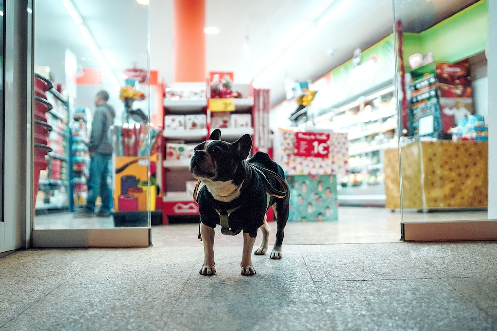

# PetWash

## Sobre esse projeto:
Nosso projeto de laboratório de Engenharia de Software deste semestre é um aplicativo chamado PetWash. O PetWash é uma iniciativa criada inicialmente na matéria de Projetos Empreendedores, consistindo em uma empresa que oferece serviços de banho para pets dentro do condomínio.  
O serviço será orquestrado por um aplicativo da PetWash, objeto de interesse neste projeto, que disponibilizaria um agenda com os horários disponíveis para lavagem dentro daquele condomínio, sendo possível criar e deletar reservas.

